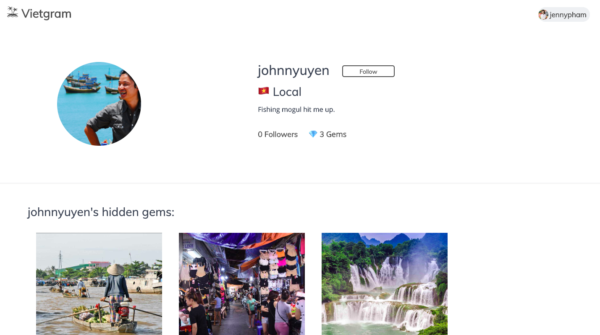
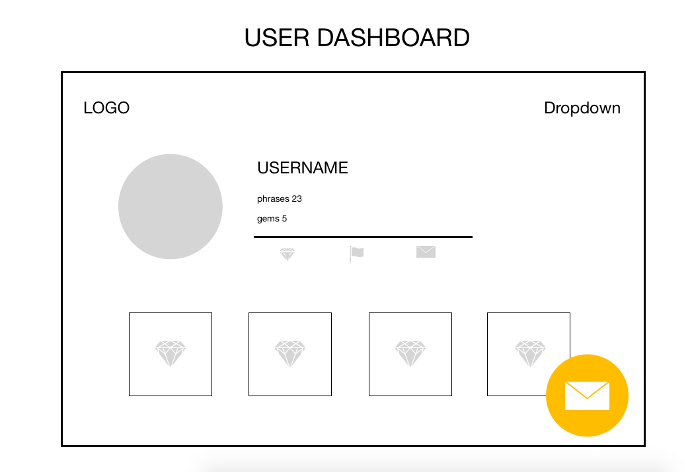

# Software Engineneering Immersive: Project 3 (Group Project)
This is a group project I built in collaboration with two other classsmates during the General Assembly Software Engineering Immersive course (Week 9).

## Team Mates:
- Gaetano Barreca: https://github.com/gaebar
- David Tsui: https://github.com/davt49

---

# Vietgram

A social networking site for explorers, bringing together hidden gems reviews and comments, all in one place.

## Built With

1. HTML5
2. SCSS & Spectre
3. Javascript
   * ECMAScript6
   * React.js
   * Node.js
   * Express.js
   * axios
4. NoSQL
   * MongoDB
5. Testing
   * Manual: Insomnia
   * Automated: Mocha & Chai
5. GitHub

## Deployment

This web app is deployed on Heroku and it can be found here: https://vietgram-app.herokuapp.com/

## Getting Started

Use the clone button to download the source code. In the terminal enter the following commands:

```
<!-- To install all the packages listed in the package.json: -->
$ yarn
<!-- Run the app in your localhost: -->
$ yarn start
<!-- Check the console for any issues and if there are check the package.json for any dependancies missing  -->
```

# User Experience

## Login & Register

When the user lands on the website they can login using the form, if they don't have an account they can click on the 'register here' link which redirects them to the register page. 


#
## Profile

After logging in, the user lands on their profile. Here they can see who follows them, the gems they posted and the ones they liked. From here they can also access the gems homepage and the chats homepage. 


#
## Gems Homepage

In this page the user can view all the gems posted on the site by other users and can filter through the different categories. 


#
## Gems Details

When the user clicks on a gem, they are redirected to the details page. Here they can view the description and can like/comment on the post.


#
## Posting/editing/deleting a new gem

The user can post a new gem clicking on the button on the homepage. There are also icons in the gems details page which allow the user to edit the title and description of the post as well as delete the post entirely (they can only do so if they were the ones who posted the image). They can also delete comments they made to a post. 


#
## Chat

The user can also choose to chat with other travellers or locals. The chat is translated in the user's chosen language. 


#
## Other users

From various points in the app the user can click on other users profile image and they are redirected to their profile, where they can follow them and see what gems they posted. 




# My contributions 👩🏻‍💻

## Planning

-- BACKEND -- 

The non-relational database we set out to build was quite complex, given the social nature of the app. So I made a sketch of the main models and how they interact with each other: 


-- FRONTEND --

I also made some wireframes so that we could get an idea of what api endpoints we needed and what user experience would end up looking like: 

<p float="left">



</p>

<p float="left">


</p>

<p float="left">


</p>

## Project Management

I was in charge of setting tasks and deadlines in the group. I used Trello to do this, which was very effective and meant that everyone could see what other people were working on to avoid merge conflicts. Here is a screenshot of a sample day: 


## My favourite code snippets I wrote: 

-- BACKEND -- 

I wrote a promise in the chat show controller, which employs a Third Party API (Yandex) to translate the chat in the user's language (which they choose when they register to the site).

```javascript
// SHOW
function showRoute(req, res, next) {
  req.body.user = req.currentUser
  const lang = req.currentUser.lang === 'vi' ? 'en-vi' : 'vi-en'
  Chat
    .findById(req.params.chatId)
    .populate('user')
    .populate('comments.user')
    .then(chat => {
      if (!chat) throw new Error('Not Found')
      return Promise.all([chat, ...chat.comments.map(comment => {
        return axios.get(encodeURI(`https://translate.yandex.net/api/v1.5/tr.json/translate?key=${key}&text=${comment.text}&lang=${lang}`))
      })])

    })
    .then(values => {
      const [ chat, ...comments ] = values
      chat.comments.forEach((comment, index) => {
        comment.text = comments[index].data.text[0]
      })
      res.json(chat)
    })
    .catch(next)
}
```

I created the social aspect of followers, using a simple controller which pushes users to a user's users array (that's a mouthful!)

```javascript
function followRoute(req, res, next) {
  req.body.user = req.currentUser
  User
    .findById(req.params.userId)
    .then(user => {
      if (!user) throw new Error('Not Found')
      if (user.followers.some(follower => follower.user._id.equals(req.currentUser._id))) return user
      user.followers.push({ user: req.currentUser })
      return user.save()
    })
    .then(user => res.status(200).json(user))
    .catch(next)
}
```

We had started off having 3 seed files for users, gems and chats however I decided to incorporate all three files into one usign a promise:

``` javascript
mongoose.connect(dbURI, { useNewUrlParser: true, useCreateIndex: true }, (err, db) => {
  if (err) console.log(err)
  db.dropDatabase()
    .then(() => {
      return User.create([
        ...
      ])
    })

    .then(users => {
      return Promise.all([
        Gem.create([
          ...
        ]),
        users
      ])
    })

    .then(data => {
      const [ gems, users ] = data
      return Chat.create([
        ...
      ])
    })
    .then(chats => {
      console.log(`${chats.length} chats created`)
    })
})
```

-- TESTING --

One of my favourite parts of this project was writing the tests as this was something I had never done before. I was personally in charge of writing the tests for the users controller, but I also became heavily involved in the other two (eg. https://github.com/MiaLearnsToCode/vietgram/commit/659eeee7c2553843bc10b5f399591964f9259e0f). 

--- FRONTEND ---

I included a small feature in the register component which uses the rest-countries API to display a flag for the user to pick what language they speak: 

```javascript
  getVnData() {
    axios('https://restcountries.eu/rest/v2/alpha/vn')
      .then(..)
      .catch(..)
  }

  getGbData() {
    axios('https://restcountries.eu/rest/v2/alpha/gb')
      .then(..)
      .catch(..)
  }
```
```html
  <div className="form-group">
    <input type="radio" id="tag-0" className="filter-tag" name="lang" value ='vi' onChange={this.handleChange} hidden />
    <input type="radio" id="tag-1" className="filter-tag" name="lang" value ='en' onChange={this.handleChange} hidden />
    <div className="filter-nav">
      <label htmlFor="tag-0">
        <figure
          className={`avatar avatar-lg ${this.state.data.lang === 'vi' ? 'badge' : ''} `}
          data-badge={`${this.state.data.lang === 'vi' ? '✔️' : ''} `}
        >
          
        </figure>
      </label>
      <label htmlFor="tag-1">
        <figure
          className={`avatar avatar-lg ${this.state.data.lang === 'en' ? 'badge' : ''} `}
          data-badge={`${this.state.data.lang === 'en' ? '✔️' : ''} `}
        >
          
        </figure>
      </label>
    </div>
  </div>
```

I built the filter feature which allows the user to filter through the site's gem based on their category:

``` javascript
  handleChange(e, n) {
    const category = e.target.value
    this.setState({ filterCategory: category, checked: n })
  }

  filterGems() {
    const regexp = new RegExp(this.state.filterCategory, 'i')
    return this.state.data.filter(gem => regexp.test(gem.category))
  }
```
```html
  <div className="gems-nav">
    <div className="filter">
      <input
        type="radio"
        id="tag-0"
        className="filter-tag"
        name="category"
        value=""
        onChange={(e) => {
          this.handleChange(e, 0)
        }
        }
        hidden/>
      <input
        ..
      />
      <div className="filter-nav">
        <label
          className={`chip ${this.state.checked === 0 ? 'bg-warning' : ''}`}
          htmlFor="tag-0">
          All
        </label>
        <label
          className={`chip ${this.state.checked === 1 ? 'bg-warning' : ''}`}
          htmlFor="tag-1">
          Markets
        </label>
        <label> 
          ..
        </label>
      </div>
    </div>
  </div>
```


## Challenges & future improvements

This was my first time working with git as version-control system in a group settings and it was quite a steep learning curve, especially as we had quite a few merge conflict. This was also by far the most complex non-relational database I've planned and worked with so far, especially given the social nature of the project ( with likes, comments, followers etc.). However, I personally really enjoyed the challenge and cannot wait to continue working on this web app independently. 

I want to add a homepage in which a user lands after login (instead of landing on their own profile), which shows all the gems that the user they follow posted. Moreover, as I enjoyed building the tests so much I will add some testing for React in the frontend using Mocha, Chai, Enzyme & Sinon. 


